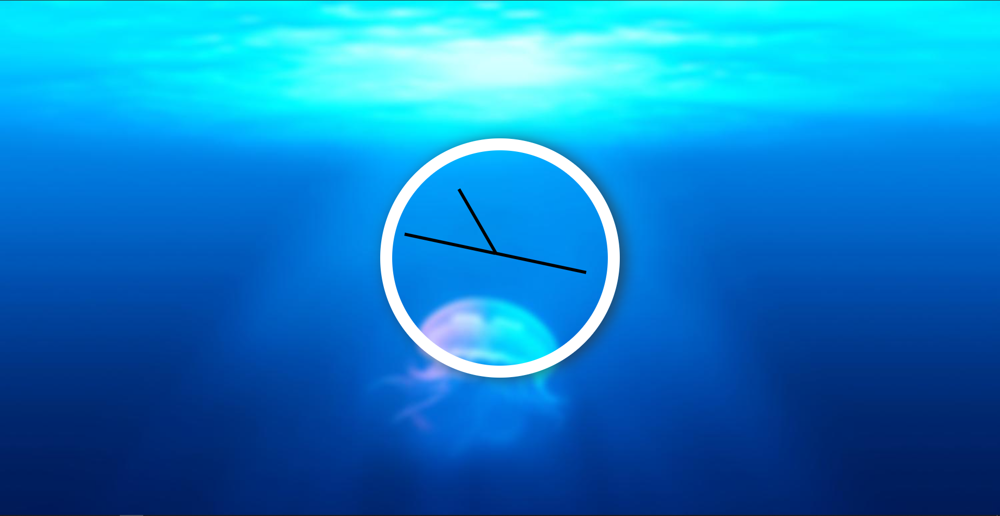

# What-s-the-Time
Just a simple Clock using HTML, CSS and Java Script

## Table of contents

- [Overview](#overview)
  - [Screenshot](#screenshot)
  - [Links](#links)
- [My process](#my-process)
  - [Built with](#built-with)
- [Author](#author)

## Overview

### Screenshot
Here is the result!

### Links

- Live Site URL: (https://ashu305.github.io/What-s-the-Time/)

## My process

### Built with

- Semantic HTML5 markup
- CSS custom properties
- Basic Java Script

## Author

- Github - [ashu305](https://github.com/ashu305)

